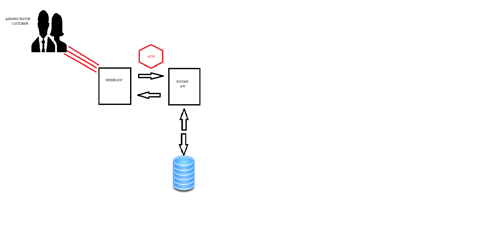

# Ticket system architecture

* How are your Webshop system build?
* Which components does your application consist of?

#  diagram webshop

# WebbShop

* Min Webbshop består utav 2 solutions, BeerWebbShop samt RestApi. 

* Mina controllers hanterar datan ifrån användaren som sedan passas vidare till min RestService som i sin tur skjuter ett Json skott 
 emot mitt RestApi. 

* I mitt RestApi tar jag emot skottet i min Controller, därefter kommunicerar min kontroller med mitt repository som har 
CRUD funktionalitet för att kommunicera med min databas med hjälp utav Entity framework.

